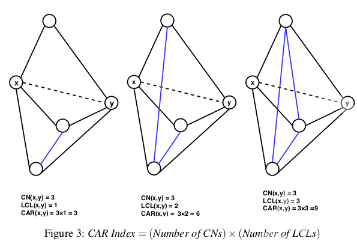

# **Link Prediction** :mag:
***Definition:*** :key: 
Link prediction finds missing links (in static networks) or predicts the likelihood of future links (in dynamic networks).

There exists a wide range of link prediction techniques like similarity-based indices, probabilistic methods, dimensionality
reduction approaches, etc.

## **Index**
1. [**Introduction**](#1-introduction-and-background)
2. [**Methods description**](#2-existing-methods-📑)

# 1. **Introduction and Background**
A **social network** (a more general term is a complex network) is a standard approach to model communication in a group or community of persons. Such networks can be represented as a graphical model in which a node maps to a person or social entity, and a link corresponds to an association or collaboration between corresponding persons or social entities. When links can be deleted or added, during time, the network is called **dynamic**. Lots of issues arise when we study a social network,
some of which are changing association patterns over time, factors that drive those associations, and the effects of those associations to other nodes. Here, we address a specific problem termed as link prediction.

#### **Problem Characterization**
Consider a simple undirected network $G(V, E)$ (Refer to the Figure 1), where $V$ characterizes a vertex-set and $E$, the link-set.

|   |   |
| - | - |
| | Network representation as a graph. |

We use (`vertex ≡ node`), (`link ≡ edge`) and (`graph ≡ network`) interchangeably. In the graph, a universal set $U$ contains a total of $\frac{n(n−1)}{2}$ links (total node-pairs), where $n = |V|$ represents the number of total vertices of the
graph.  
(|U| − |E|) number of links are termed as the *non-existing links*, and some of these links may appear in the near future when we talk about dynamic network. ***Finding such missing links (i.e., AC, BD, and AD) is the aim of link prediction***.

The link prediction problem can be defined as follow: 
*Suppose a graph* $\mathit{G\_{t\_0 − t\_1} (V, E)}$ *represents a snapshot of a network during time interval* $\mathit{[t_0 ,t_1]}$ *and* $\mathit{E_{t_0 − t_1}}$ *, a set of links  present in that snapshot. The task of link prediction is to find set of links* $\mathit{E_{t_0' − t_1'}}$ *during the time interval* $\mathit{[t_0' ,t_1']}$ *where* $\mathit{[t_0 ,t_1] \leq [t_0' ,t_1']}$ *.*

The link prediction idea is useful in several domains of application. Examples include automatic hyperlink creation, website hyper-link prediction in the Internet
and web science domain, and friend recommendation on Facebook.

# 2. **Existing methods** :bookmark_tabs:
Recently, numerous methodologies of link prediction have been implemented. These methods can be grouped into several categories, like **similarity-based, probabilistic models, learning-based models**, etc.

### ***Sub-Index*** :open_file_folder:
#### 2.1 [**Similarity-based methods**](#21-similarity-based-methods)  
&nbsp;&nbsp;2.1.1 [**Local similarity indices**](#211-local-similarity-indices) 
&nbsp;&nbsp;2.1.2 [**Global similarity indices**](#212-global-similarity-indices) 
&nbsp;&nbsp;2.1.3 [**Quasi-local Indices**](#213-quasi-local-indices) 
#### 2.2 [**Probabilistic and maximum likelihood models**](#22-probabilistic-and-maximum-likelihood-models)  
&nbsp;&nbsp;2.2.1 [**Local probabilistic model for link prediction**](#221-local-probabilistic-model-for-link-prediction) 
&nbsp;&nbsp;2.2.2 [**Probabilistic relational model for link prediction (PRM)**](#222-probabilistic-relational-model-for-link-prediction-prm) 
&nbsp;&nbsp;2.2.3 [**Hierarchical structure model (HSM)**](#223-hierarchical-structure-model-hsm) 
&nbsp;&nbsp;2.2.4 [**Stochastic block model (SBM)**](#224-stochastic-block-model-sbm) 
&nbsp;&nbsp;2.2.5 [**Exponential random graph model (ERGM) or P-star model**](#225-exponential-random-graph-model-ergm-or-p-star-model) 
#### 2.3 [**Link prediction using dimensionality reduction**](#23-link-prediction-using-dimensionality-reduction)  
&nbsp;&nbsp;2.3.1 [**Embedding-based link prediction**](#231-embedding-based-link-prediction) 
&nbsp;&nbsp;2.3.2 [**Matrix factorization/decomposition-based link prediction**](#232-matrix-factorizationdecomposition-based-link-prediction) 
#### 2.4 [**Other approaches**](#24-other-approaches)  
&nbsp;&nbsp;2.4.1 [**Learning-based frameworks for link prediction**](#241-learning-based-frameworks-for-link-prediction) 
&nbsp;&nbsp;2.4.2 [**Information theory-based link prediction**](#242-information-theory-based-link-prediction) 
&nbsp;&nbsp;2.4.3 [**Clustering-based Link Prediction**](#243-clustering-based-link-prediction) 
&nbsp;&nbsp;2.4.4 [**Structural Perturbation Method**](#244-structural-perturbation-method) 

 

## 2.1 **Similarity-based methods**
Similarity-based metrics are the simplest one in link prediction, in which for each pair $x$ and $y$, a similarity score $S(x, y)$ is calculated. The score $S(x, y)$ is based on the structural or node’s properties of the considered pair. The non-observed links (i.e., $U − E^T$ ) are assigned scores according to their similarities. **The pair of nodes having a higher score represents the predicted link between them**. The similarity measures between every pair *can be calculated using several properties of the network*, one of which is structural property. Scores based on this property can be grouped in several categories like **local and global**, and so on.

### 2.1.1 **Local similarity indices**
Local indices are generally calculated using information about common neighbors and node degree. These indices **consider immediate neighbors of a node**. The following are some examples of local similarity indices with a description and method to calculate them:
- `Common Neighbors (CN)`: In a given network or graph, the size of common neighbors for a given pair of nodes $x$ and $y$ is calculated as the size of the intersection of the two nodes neighborhoods ( $\Gamma$ ).
    $$S(x, y) = |\Gamma(x) \cap \Gamma(y)|$$
    The likelihood of the existence of a link between x and y increases with the number of common neighbors between them.
- `Jaccard Coefficient`: This metric is similar to the Common Neighbors. Additionally, it normalizes the above score, as given below:
    $$S(x, y) = \frac{|\Gamma(x) \cap \Gamma(y)|}{|\Gamma(x) \cup \Gamma(y)|}$$
    The Jaccard coefficient is defined as the probability of selection of common neighbors of pairwise vertices from all the neighbors of either vertex. The pairwise Jaccard score increases with the number of common neighbors between the two vertices considered. Some researcher (***Liben-Nowell et al.***) demonstrated that this similarity metric **performs worse** as compared to Common Neighbors.
- `Adamic/Adar Index (AA)`: Adamic and Adar presented a metric to calculate a similarity score between two web pages based on shared features, which are further used in link prediction after some modification
    $$S(x, y) = \sum_{z \in \Gamma(x) \cap \Gamma(y)} \frac{1}{log k_z}$$
    where $k_z$ is the degree of the node $z$. It is clear from the equation that more weights are assigned to the common neighbors having smaller degrees. This is also intuitive in the real-world scenario, for example, a person with more number of friends spend less time/resource with an individual friend as compared to the less number of friends.
- `Preferential Attachment (PA)`: The idea of preferential attachment is applied to generate a growing scale-free network. The term **growing** represents the incremental nature of nodes over time in the network. The likelihood incrementing new connection associated with a node $x$ is proportional to $k_x$ , the degree of the node. Preferential attachment score between two nodes x and y can be computed as:
    $$S(x, y) = k_x k_y$$
    This index shows the worst performance on most networks. The **simplicity**
(as it requires the least information for the score calculation) and the **computational time** of this metric are the main advantages. PA shows better results if larger degree nodes are densely connected, and lower degree nodes are rarely connected. In the above equation, summation can also be used instead of multiplication as an aggregate function.
- `Resource Allocation Index (RA)`: Consider two non-adjacent vertices $x$ and $y$. Suppose node $x$ sends some resources to $y$ through the common nodes of both $x$ and $y$ then the similarity between the two vertices is computed in terms of **resources sent** from $x$ to $y$. This is expressed mathematically as:
    $$S(x, y) = \sum_{z \in \Gamma(x) \cap \Gamma(y)} \frac{1}{k_z}$$
    The difference between **RA** and **AA** is that the RA index heavily penalizes to higher degree nodes compared to the AA index. Prediction results of these indices become almost the same for smaller average degree networks. This index
shows good performance on heterogeneous networks with a high clustering coefficient, especially on transportation networks.
- `Cosine similarity or Salton Index (SI)`: This similarity index between two records (documents) is measured by calculating the Cosine of the angle between them. The metric is all about the orientation and not magnitude. The Cosine similarity can be computed as
    $$S(x, y) = \frac{|\Gamma(x) \cap \Gamma(y)|}{\sqrt(k_x k_y)}$$
- `Sorensen Index`: It is very similar to the Jaccard index. **McCune et al.** show that it **is more robust than Jaccard against the outliers**.
    $$S(x, y) = \frac{2|\Gamma(x) \cap \Gamma(y)|}{k_X + k_y}$$
- `CAR-based Common Neighbor Index (CAR)`: CAR-based indices are presented based on the assumption that the link existence between two nodes is more likely if their common neighbors are members of a local community (local-community-paradigm (LCP) theory). In other words, the likelihood existence increases with the number of links among the common neighbors (local community links (LCLs)) of the seed node pair as described in the following figure.
    $$S(x, y) = CN(x, y) \text{ x } LCL(x, y) = CN(x, y) \text{ x } \sum_{z \in \Gamma(x) \cap \Gamma(y)} \frac{|\gamma(z)|}{2} $$
    where $CN(x, y) = |\Gamma(x) ∩ \Gamma(y)|$ is number of common neighbors. $LCL(x, y)$ refers to the number of local community links which are defined as the links among the common neighbors of seed nodes x and y. $\gamma(z)$ is the subset of neighbors of node $z$ that are also common neighbors of $x$ and $y$.  
     
- `CAR-based Adamic/Adar Index (CAA)`: If $LCL$ is considered as an accuracy enhancer, then the $CAA$ index is obtained by incorporating the $LCL$ theory to the well known AA index and mathematically expressed by the equation given below.
    $$S(x, y) = \sum_{z \in \Gamma(x) \cap \Gamma(y)} \frac{|\gamma(z)|}{\log_2(k_z)} $$
- `CAR-based Resource Allocation Index (CRA)`: Is a general application of the LCL theory to other indices and generate the CRA index by incorporating this concept into the existing RA index of the literature. Mathematically, the CRA can be expressed as
    $$S(x, y) = \sum_{z \in \Gamma(x) \cap \Gamma(y)} \frac{|\gamma(z)|}{k_z}$$
- `CAR-based Preferential Attachment Index (CPA)`: This is the preferential attachment index based on the CAR index. CPA is obtained by incorporating the LCL theory to the original PA method and expressed mathematically by
    $$S(x, y) = e_x e_y + e_x CAR(x, y) + e_y CAR(x, y) + CAR(x, y)^2$$
    where $e_x$ is the number of neighbors of $x$ not shared by $y$ and $CAR(x, y)$ is the similarity score of the node pair $x$ and $y$ using CAR index.  
    CAR-based methods listed above show the best performance on LCP networks. The LCP networks are related to dynamic and heterogeneous systems and facilitate network evolution of social and biological networks.
- `Hub Promoted Index (HPI)`: This similarity index promotes the formation of links between the sparsely connected nodes and hubs. It also tries to prevent links formation between the hub nodes. This similarity metric can be expressed mathematically as
    $$S(x, y) = \frac{|\Gamma(x) \cap \Gamma(y)|}{min(k_x, k_y)}$$
- `Hub Depressed Index (HDI)`: This index is the same as the previous one but with the opposite goal as it avoids the formation of links between hubs and low degree nodes in the networks. The Hub depressed index promotes the links evolution between the hubs as well as the low degree nodes. The mathematical expression for this index is given below.
    $$S(x, y) = \frac{|\Gamma(x) \cap \Gamma(y)|}{max(k_x, k_y)}$$
- `Local Naive Bayes-based Common Neighbors (LNBCN)`: The above similarity indices are somehow based on common neighbors of the node pair where each of the which are equally weighted. This method is based on the Naive Bayes theory and arguments that different common neighbors play different role in the network and hence contributes differently to the score function computed for non-observed node pairs
    $$S(x, y) = \sum_{z \in \Gamma(x) \cap \Gamma(y)} [log(\frac{C(z)}{1 - C(z)}) + log(\frac{1 - \rho}{\rho})]$$
    where $C(z)$ is node clustering coefficient and $\rho$ is the network density expressed as
    $$\rho = \frac{|E|}{n(n-1)/2}$$
- `Leicht-Holme-Newman Local Index (LHNL)`: The logic below this index is that two vertices are similar to each other if their corresponding neighbors are self-similar to themselves. This score is defined by the ratio of the path of length two that exits between two vertices and the expected path of the same length between them.
    $$S(x, y) = \frac{|\Gamma(x) \cap \Gamma(y)|}{k_x k_y}$$
- `Node Clustering Coefficient (CCLP)`: This index is also based on the clustering coefficient property of the network in which the clustering coefficients of all the common neighbors of a seed node pair are computed and summed to find the final similarity score of the pair. Mathematically
    $$S(x, y) = \sum_{z \in \Gamma(x) \cap \Gamma(y)} C(z)$$
    where
    $$C(z) = \frac{t(z)}{k_z(k_z - 1)}$$
    is clustering coefficient of the node $z$ and $t(z)$ is the total triangles passing through the node $z$.
- `Node and Link Clustering coefficient (NLC)`: This similarity index is based on the basic topological feature of a network called ”*Clustering Coefficient*”. The
clustering coefficients of both nodes and links are
incorporated to compute the similarity score.
    $$S(x, y) = \sum_{z \in \Gamma(x) \cap \Gamma(y)} \frac{|\Gamma(x) \cap \Gamma(z)|}{k_z -1} \text{ x }C(z) + \frac{|\Gamma(y) \cap \Gamma(z)|}{k_z -1} \text{ x }C(z)$$

 

### 2.1.2 **Global similarity indices**
Global indices are computed using entire topological information of a network. The computational complexities of such methods are higher and seem to be infeasible for large networks.
- `Katz Index`: This index can be considered as a variant of the shortest path metric. It directly aggregates over all the paths between x and y and dumps exponentially for longer paths to penalize them. It can be expressed mathematically as:
    $$S(x, y) = \sum_{l = 1}^{\infty}\beta^l|paths_{x, y}^{<l>}| = \sum_{l = 1}^{\infty}\beta^l(A)^l_{x, y}$$
    where, $paths_{x, y}^{<l>}$ is considered as the set of total $l$ length paths between $x$ and $y$, $\beta$ is a damping factor that controls the path weights and A is the adjacency matrix. For the convergence of above equation,
    $$\beta < \frac{1}{\lambda_1} $$
    where $\lambda_1$ is the maximum eigen value of the matrix A.  
    If 1 is added to each element of the diagonal of the resulting similarity matrix S, this expression can be written in matrix terms as
    $$S = \beta AS + I$$
    where $I$ is the identity matrix of the proper dimension. The similarity between all pairs of nodes can be directly computed using the closed-form by rearranging for $S$ in the previous expression and subtracting the previously added 1 to the elements in the diagonal. Katz score for each pair of nodes in the network is calculated by finding the similarity matrix as
    $$S = (I − \beta A)^{− 1} − I$$
    The computational complexity of the given metric is high, and it can be roughly estimated to be cubic complexity which is not feasible for a large network.
- `Random Walk with Restart (RWR)`: Let $\alpha$ be a probability that a random walker iteratively moves to an arbitrary neighbor and returns to the same starting vertex with probability $(1 − \alpha)$. Consider $q_{xy}) to be the probability that a random walker who starts walking from vertex $x$ and located at the vertex $y$ in steady-state. Now, this probability of walker to reach the vertex $y$ is expressed mathematically as
    $$\overrightarrow{q_x} = \alpha P^T \overrightarrow{q_x} + (1-\alpha) \overrightarrow{e_x}$$
    where $\overrightarrow{e_x}$ is the seed vector of length $|V|$ (i.e., the total number of vertices in the graph). This vector consists of zeros for all components except the elements $x$ itself. The transition matrix $P$ can be expressed as
    $$\overrightarrow{q_x} = (1-\alpha)(I - \alpha P^T)^{-1} \overrightarrow{e_x}$$
    Since this similarity is not symmetric, the final score between the node pair (x, y) can be computed as
    $$S(x, y) = q_{xy} + q_{yx}$$
    It is clear from the above equation that matrix inversion is required to solve, which is quite expensive and prohibitive for large networks.
- `Shortest Path`: The inverse relation between the similarity and length of the shortest path is captured by the following mathematical equation given below.
    $$S(x, y) = -|d(x, y)|$$
    where Dijkstra algorithm is applied to efficiently compute the shortest path d(x, y) between the node pair (x, y). The prediction accuracy of this index is low compared to most local indices.
- `Leicht-Holme-Newman Global Index (LHNG)`: This global index is based on the principle that two nodes are similar if either of them has an immediate neighbor, which is similar to the other node. This is a recursive definition of similarity where a termination condition is needed. The termination condition is introduced in terms of self-similarity, i.e., a node is similar to itself. Thus, the similarity score equation consists of two terms: first, the neighbor similarity, and the second, self-similarity, as given below.
    $$S(x, y) = \phi  \sum_z A_{x, z} S_{z, y} + \psi \delta_{x, y}$$
    Here, the first term is neighborhood similarity and the second term is self-similarity. $\psi$ and $\phi$ are free parameters that make a balance between these two terms. When the free parameter $\psi$ = 1, this index resembles to the Katz index.
- `Cosine based on L+ (Cos+)`: Laplacian matrix is extensively used as an alternative representation of graphs in spectral graph theory. This matrix can be defined as $L = D − A$, where, $D$ is the diagonal matrix consistingof the degrees of each node of the matrix and $A$ is the adjacency matrix of the graph. The pseudoinverse of the matrix defined by Moore-Penrose is represented as $L^+$ and each entry of this matrix is used to represent the similarity score between the two corresponding nodes. The most common way to compute this pseudoinverse is by computing the **singular value decomposition (SVD)** of the Laplacian matrix [ $(L = U \Sigma V^T) $, where $U$ and $V$ are left and right singular vectors of $SVD$ ] as follows
    $$L^+ = V \Sigma^+ U^T$$
    $\Sigma^+$ is obtained by taking the inverse of each nonzero element of the $\Sigma$. Further, the similarity between two nodes $x$ and $y$ can be computed using any inner product measure such as Cosine similarity given as
    $$S(x, y) = \frac{L_{x, y}^+}{\sqrt{L_{x, x}^+ L_{y, y}^+}}$$
- `Average Commute Time (ACT)`: This index is based on the random walk concept. A random walk is a Markov chain which describes the movements of a walker. It defined as the average number of movements/steps required by a random walker to reach the destination node $y$, and come back to the starting node $x$. If $m(x, y)$ be the number of steps required by the walker to reach $y$ from $x$, then the following expression captures this concept.
    $$n(x, y) = |E| (l_{xx}^+ + l_{yy}^+ - 2l_{xy}^+) $$
    where $l_{xy}^+$ denotes the $(x, y)$ entry of the matrix $L^+$ . Pseudoinverse of the Laplacian, $L^+$ can be computed as
    $$L^+ = (L - \frac{ee^T}{n})^{-1} + \frac{ee^T}{n}$$
    where $e$ is a column vector consisting of 1’s.  
    Smaller value of this equation will represent higher similarity. The final expression is the following
    $$S(x, y) = \frac{1}{l_{xx}^+ + l_{yy}^+ - 2l_{xy}^+}$$
- `Normalized Average Commute Time (NACT)`: This is a variant of ACT that takes into account node degrees. For a high degree node (hub) $y$, $m(x, y)$ is usually small regardless of $x$, the similarity measure is normalized with stationary distribution $\pi$ of the Markov chain describing random walker on the graph. This normalized measure can be computed with the following equation
    $$S(x, y) = \frac{1}{(m(x, y)\pi_y + m(y, x)\pi_x)}$$
- `Matrix Forest Index (MF)`: his index is based on the concept of spanning tree which is defined as the subgraph that spans total nodes without forming any cycle. The spanning tree may contain total or less number of links as compared to the original graph. Chebotarev and Shamis proposed a theorem called matrix-forest theorem which states that the number of spanning tree in a graph is equal to the cofactor of any entry of Laplacian matrix of the graph. Here, the term forest represents the union of all rooted disjoint spanning trees. The similarity between two nodes $x$ and $y$ can be computed with the equation given below
    $$S = (I + L)^{-1}$$
    where $(I + L)_{(x,y)}$ is the number of spanning rooted forests ($x$ as root) consisting of both the nodes $x$ and $y$. Moreover, this quantity is equal to the cofactor of $(I + L)_{(x,y)}$ .
- `SimRank`: This is a measure of structural context similarity and shows object-to-object relationships. It is not domain-specific and recommends to apply in directed or mixed networks. The basic assumption of this measure is that two objects are similar if they are related to similar objects. SimRank computes how soon two random walkers meet each other, starting from two different positions. This measure can be represented in matrix form as
    $$S(x,y) = \alpha W^T SW + (1 - \alpha)I$$
    where, $\alpha \in (0, 1)$ is a constant. $W$ is the transformation matrix and computed by normalizing each column of adjacency matrix $A$ as $W_{ij} = \frac{a_{ij}}{\sum_{k=1}^{n}}$  
    The computational complexity of this measure is high for a large network, and to reduce its time, the authors suggest pruning recursive branches.
- `Rooted Pagerank (RPR)`: The idea of PageRank was originally proposed to rank the web pages based on the importance of those pages. The algorithm is based on the assumption that a random walker randomly goes to a web page with probability $\alpha$ and follows hyper-link embedded in the page with probability $(1 − \alpha)$. Chung et al. used this concept incorporated with a random walk in link prediction framework. The importance of web pages, in a random walk, can be replaced by stationary distribution. The similarity between two vertices $x$ and $y$ can be measured by the stationary probability of $y$ from $x$ in a random walk where the walker moves to an arbitrary neighboring vertex with probability $\alpha$ and returns to $x$ with probability $(1 − \alpha)$. Mathematically, this score can be computed for all pair of vertices as
    $$RPR = (1 - \alpha)(I - \alpha \hat{N})^{-1}$$
    where $\hat{N} = D^{−1} A$ is the normalized adjacency matrix with the diagonal degree matrix $D[i, i] = \sum_j A[i, j]$.

 

### 2.1.3 **Quasi-local Indices**

## 2.2 **Probabilistic and maximum likelihood models**
### 2.2.1 **Local probabilistic model for link prediction**
### 2.2.2 **Probabilistic relational model for link prediction (PRM)**
### 2.2.3 **Hierarchical structure model (HSM)**
### 2.2.4 **Stochastic block model (SBM)**
### 2.2.5 **Exponential random graph model (ERGM) or P-star model**

## 2.3 **Link prediction using dimensionality reduction**
### 2.3.1 **Embedding-based link prediction**
### 2.3.2 **Matrix factorization/decomposition-based link prediction**

## 2.4 **Other approaches**
### 2.4.1 **Learning-based frameworks for link prediction**
### 2.4.2 **Information theory-based link prediction**
### 2.4.3 **Clustering-based Link Prediction**
### 2.4.4 **Structural Perturbation Method**