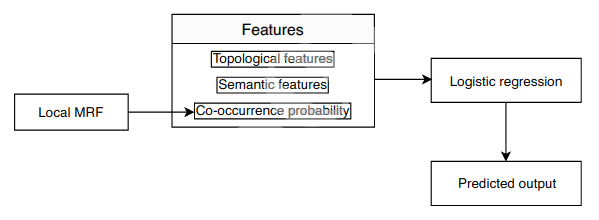
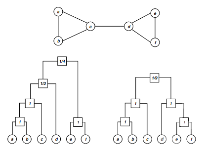
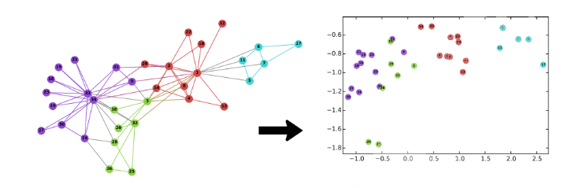
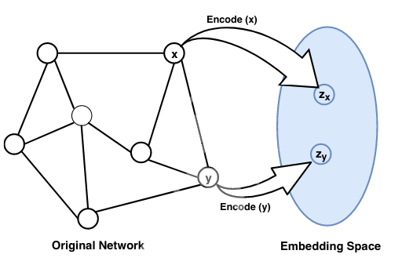
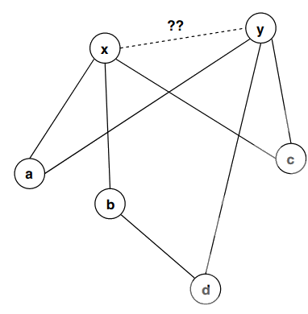

# **Link Prediction** :mag:
***Definition:*** :key: 
Link prediction finds missing links (in static networks) or predicts the likelihood of future links (in dynamic networks).

There exists a wide range of link prediction techniques like similarity-based indices, probabilistic methods, dimensionality reduction approaches, etc.

## **Index**
1. [**Introduction**](#1-introduction-and-background)
2. [**Methods description**](#2-existing-methods-📑)
3. [**References**](#references)

# 1. **Introduction and Background**
A **social network** (a more general term is a complex network) is a standard approach to model communication in a group or community of persons. Such networks can be represented as a graphical model in which a node maps to a person or social entity, and a link corresponds to an association or collaboration between corresponding persons or social entities. When links can be deleted or added, during time, the network is called **dynamic**. Lots of issues arise when we study a social network, some of which are changing association patterns over time, factors that drive those associations, and the effects of those associations to other nodes. Here, we address a specific problem termed as link prediction.

#### **Problem Characterization**
Consider a simple undirected network $G(V, E)$ (Refer to the Figure 1), where $V$ characterizes a vertex-set and $E$, the link-set.

|   |   |
| - | - |
| | Network representation as a graph. |

We use (`vertex ≡ node`), (`link ≡ edge`) and (`graph ≡ network`) interchangeably. In the graph, a universal set $U$ contains a total of $\frac{n(n−1)}{2}$ links (total node-pairs), where $n = |V|$ represents the number of total vertices of the
graph.  
(|U| − |E|) number of links are termed as the *non-existing links*, and some of these links may appear in the near future when we talk about dynamic network. ***Finding such missing links (i.e., AC, BD, and AD) is the aim of link prediction***.

The link prediction problem can be defined as follow: 
*Suppose a graph* $\mathit{G\_{t\_0 − t\_1} (V, E)}$ *represents a snapshot of a network during time interval* $\mathit{[t_0 ,t_1]}$ *and* $\mathit{E_{t_0 − t_1}}$ *, a set of links  present in that snapshot. The task of link prediction is to find set of links* $\mathit{E_{t_0' − t_1'}}$ *during the time interval* $\mathit{[t_0' ,t_1']}$ *where* $\mathit{[t_0 ,t_1] \leq [t_0' ,t_1']}$ *.*

The link prediction idea is useful in several domains of application. Examples include automatic hyperlink creation, website hyper-link prediction in the Internet
and web science domain, and friend recommendation on Facebook.

# 2. **Existing methods** :bookmark_tabs:
Recently, numerous methodologies of link prediction have been implemented. These methods can be grouped into several categories, like **similarity-based, probabilistic models, learning-based models**, etc.

### ***Sub-Index*** :open_file_folder:
#### 2.1 [**Similarity-based methods**](#21-similarity-based-methods)  
&nbsp;&nbsp;2.1.1 [**Local similarity indices**](#211-local-similarity-indices) 
&nbsp;&nbsp;2.1.2 [**Global similarity indices**](#212-global-similarity-indices) 
&nbsp;&nbsp;2.1.3 [**Quasi-local Indices**](#213-quasi-local-indices) 
#### 2.2 [**Probabilistic and maximum likelihood models**](#22-probabilistic-and-maximum-likelihood-models)  
&nbsp;&nbsp;2.2.1 [**Local probabilistic model for link prediction**](#221-local-probabilistic-model-for-link-prediction) 
&nbsp;&nbsp;2.2.2 [**Probabilistic relational model for link prediction (PRM)**](#222-probabilistic-relational-model-for-link-prediction-prm) 
&nbsp;&nbsp;2.2.3 [**Hierarchical structure model (HSM)**](#223-hierarchical-structure-model-hsm) 
&nbsp;&nbsp;2.2.4 [**Stochastic block model (SBM)**](#224-stochastic-block-model-sbm) 
&nbsp;&nbsp;2.2.5 [**Exponential random graph model (ERGM) or P-star model**](#225-exponential-random-graph-model-ergm-or-p-star-model) 
#### 2.3 [**Link prediction using dimensionality reduction**](#23-link-prediction-using-dimensionality-reduction)  
&nbsp;&nbsp;2.3.1 [**Embedding-based link prediction**](#231-embedding-based-link-prediction) 
&nbsp;&nbsp;2.3.2 [**Matrix factorization/decomposition-based link prediction**](#232-matrix-factorizationdecomposition-based-link-prediction) 
#### 2.4 [**Other approaches**](#24-other-approaches)  
&nbsp;&nbsp;2.4.1 [**Learning-based frameworks for link prediction**](#241-learning-based-frameworks-for-link-prediction) 
&nbsp;&nbsp;2.4.2 [**Information theory-based link prediction**](#242-information-theory-based-link-prediction) 
&nbsp;&nbsp;2.4.3 [**Clustering-based Link Prediction**](#243-clustering-based-link-prediction) 
&nbsp;&nbsp;2.4.4 [**Structural Perturbation Method**](#244-structural-perturbation-method) 

 

## 2.1 **Similarity-based methods**
Similarity-based metrics are the simplest one in link prediction, in which for each pair $x$ and $y$, a similarity score $S(x, y)$ is calculated. The score $S(x, y)$ is based on the structural or node’s properties of the considered pair. The non-observed links (i.e., $U − E^T$ ) are assigned scores according to their similarities. **The pair of nodes having a higher score represents the predicted link between them**. The similarity measures between every pair *can be calculated using several properties of the network*, one of which is structural property. Scores based on this property can be grouped in several categories like **local and global**, and so on.

### 2.1.1 **Local similarity indices**
Local indices are generally calculated using information about common neighbors and node degree. These indices **consider immediate neighbors of a node**. The following are some examples of local similarity indices with a description and method to calculate them:
- `Common Neighbors (CN)`: In a given network or graph, the size of common neighbors for a given pair of nodes $x$ and $y$ is calculated as the size of the intersection of the two nodes neighborhoods ( $\Gamma$ ).
    $$S(x, y) = |\Gamma(x) \cap \Gamma(y)|$$
    The likelihood of the existence of a link between x and y increases with the number of common neighbors between them.
- `Jaccard Coefficient`: This metric is similar to the Common Neighbors. Additionally, it normalizes the above score, as given below:
    $$S(x, y) = \frac{|\Gamma(x) \cap \Gamma(y)|}{|\Gamma(x) \cup \Gamma(y)|}$$
    The Jaccard coefficient is defined as the probability of selection of common neighbors of pairwise vertices from all the neighbors of either vertex. The pairwise Jaccard score increases with the number of common neighbors between the two vertices considered. Some researcher (**Liben-Nowell et al.**) demonstrated that this similarity metric **performs worse** as compared to Common Neighbors.
- `Adamic/Adar Index (AA)`: Adamic and Adar presented a metric to calculate a similarity score between two web pages based on shared features, which are further used in link prediction after some modification
    $$S(x, y) = \sum_{z \in \Gamma(x) \cap \Gamma(y)} \frac{1}{log k_z}$$
    where $k_z$ is the degree of the node $z$. It is clear from the equation that more weights are assigned to the common neighbors having smaller degrees. This is also intuitive in the real-world scenario, for example, a person with more number of friends spend less time/resource with an individual friend as compared to the less number of friends.
- `Preferential Attachment (PA)`: The idea of preferential attachment is applied to generate a growing scale-free network. The term **growing** represents the incremental nature of nodes over time in the network. The likelihood incrementing new connection associated with a node $x$ is proportional to $k_x$ , the degree of the node. Preferential attachment score between two nodes x and y can be computed as:
    $$S(x, y) = k_x k_y$$
    This index shows the worst performance on most networks. The **simplicity**
(as it requires the least information for the score calculation) and the **computational time** of this metric are the main advantages. PA shows better results if larger degree nodes are densely connected, and lower degree nodes are rarely connected. In the above equation, summation can also be used instead of multiplication as an aggregate function.
- `Resource Allocation Index (RA)`: Consider two non-adjacent vertices $x$ and $y$. Suppose node $x$ sends some resources to $y$ through the common nodes of both $x$ and $y$ then the similarity between the two vertices is computed in terms of **resources sent** from $x$ to $y$. This is expressed mathematically as:
    $$S(x, y) = \sum_{z \in \Gamma(x) \cap \Gamma(y)} \frac{1}{k_z}$$
    The difference between **RA** and **AA** is that the RA index heavily penalizes to higher degree nodes compared to the AA index. Prediction results of these indices become almost the same for smaller average degree networks. This index
shows good performance on heterogeneous networks with a high clustering coefficient, especially on transportation networks.
- `Cosine similarity or Salton Index (SI)`: This similarity index between two records (documents) is measured by calculating the Cosine of the angle between them. The metric is all about the orientation and not magnitude. The Cosine similarity can be computed as
    $$S(x, y) = \frac{|\Gamma(x) \cap \Gamma(y)|}{\sqrt{(k_x k_y)}}$$
- `Sorensen Index`: It is very similar to the Jaccard index. **McCune et al.** show that it **is more robust than Jaccard against the outliers**.
    $$S(x, y) = \frac{2|\Gamma(x) \cap \Gamma(y)|}{k_X + k_y}$$
- `CAR-based Common Neighbor Index (CAR)`: CAR-based indices are presented based on the assumption that the link existence between two nodes is more likely if their common neighbors are members of a local community (local-community-paradigm (LCP) theory). In other words, the likelihood existence increases with the number of links among the common neighbors (local community links (LCLs)) of the seed node pair as described in the following figure.
    $$S(x, y) = CN(x, y) \text{ x } LCL(x, y) = CN(x, y) \text{ x } \sum_{z \in \Gamma(x) \cap \Gamma(y)} \frac{|\gamma(z)|}{2} $$
    where $CN(x, y) = |\Gamma(x) ∩ \Gamma(y)|$ is number of common neighbors. $LCL(x, y)$ refers to the number of local community links which are defined as the links among the common neighbors of seed nodes x and y. $\gamma(z)$ is the subset of neighbors of node $z$ that are also common neighbors of $x$ and $y$.  
     
- `CAR-based Adamic/Adar Index (CAA)`: If $LCL$ is considered as an accuracy enhancer, then the $CAA$ index is obtained by incorporating the $LCL$ theory to the well known AA index and mathematically expressed by the equation given below.
    $$S(x, y) = \sum_{z \in \Gamma(x) \cap \Gamma(y)} \frac{|\gamma(z)|}{\log_2(k_z)} $$
- `CAR-based Resource Allocation Index (CRA)`: Is a general application of the LCL theory to other indices and generate the CRA index by incorporating this concept into the existing RA index of the literature. Mathematically, the CRA can be expressed as
    $$S(x, y) = \sum_{z \in \Gamma(x) \cap \Gamma(y)} \frac{|\gamma(z)|}{k_z}$$
- `CAR-based Preferential Attachment Index (CPA)`: This is the preferential attachment index based on the CAR index. CPA is obtained by incorporating the LCL theory to the original PA method and expressed mathematically by
    $$S(x, y) = e_x e_y + e_x CAR(x, y) + e_y CAR(x, y) + CAR(x, y)^2$$
    where $e_x$ is the number of neighbors of $x$ not shared by $y$ and $CAR(x, y)$ is the similarity score of the node pair $x$ and $y$ using CAR index.  
    CAR-based methods listed above show the best performance on LCP networks. The LCP networks are related to dynamic and heterogeneous systems and facilitate network evolution of social and biological networks.
- `Hub Promoted Index (HPI)`: This similarity index promotes the formation of links between the sparsely connected nodes and hubs. It also tries to prevent links formation between the hub nodes. This similarity metric can be expressed mathematically as
    $$S(x, y) = \frac{|\Gamma(x) \cap \Gamma(y)|}{min(k_x, k_y)}$$
- `Hub Depressed Index (HDI)`: This index is the same as the previous one but with the opposite goal as it avoids the formation of links between hubs and low degree nodes in the networks. The Hub depressed index promotes the links evolution between the hubs as well as the low degree nodes. The mathematical expression for this index is given below.
    $$S(x, y) = \frac{|\Gamma(x) \cap \Gamma(y)|}{max(k_x, k_y)}$$
- `Local Naive Bayes-based Common Neighbors (LNBCN)`: The above similarity indices are somehow based on common neighbors of the node pair where each of the which are equally weighted. This method is based on the Naive Bayes theory and arguments that different common neighbors play different role in the network and hence contributes differently to the score function computed for non-observed node pairs
    $$S(x, y) = \sum_{z \in \Gamma(x) \cap \Gamma(y)} [log(\frac{C(z)}{1 - C(z)}) + log(\frac{1 - \rho}{\rho})]$$
    where $C(z)$ is node clustering coefficient and $\rho$ is the network density expressed as
    $$\rho = \frac{|E|}{n(n-1)/2}$$
- `Leicht-Holme-Newman Local Index (LHNL)`: The logic below this index is that two vertices are similar to each other if their corresponding neighbors are self-similar to themselves. This score is defined by the ratio of the path of length two that exits between two vertices and the expected path of the same length between them.
    $$S(x, y) = \frac{|\Gamma(x) \cap \Gamma(y)|}{k_x k_y}$$
- `Node Clustering Coefficient (CCLP)`: This index is also based on the clustering coefficient property of the network in which the clustering coefficients of all the common neighbors of a seed node pair are computed and summed to find the final similarity score of the pair. Mathematically
    $$S(x, y) = \sum_{z \in \Gamma(x) \cap \Gamma(y)} C(z)$$
    where
    $$C(z) = \frac{t(z)}{k_z(k_z - 1)}$$
    is clustering coefficient of the node $z$ and $t(z)$ is the total triangles passing through the node $z$.
- `Node and Link Clustering coefficient (NLC)`: This similarity index is based on the basic topological feature of a network called ”*Clustering Coefficient*”. The
clustering coefficients of both nodes and links are
incorporated to compute the similarity score.
    $$S(x, y) = \sum_{z \in \Gamma(x) \cap \Gamma(y)} \frac{|\Gamma(x) \cap \Gamma(z)|}{k_z -1} \text{ x }C(z) + \frac{|\Gamma(y) \cap \Gamma(z)|}{k_z -1} \text{ x }C(z)$$

 

### 2.1.2 **Global similarity indices**
Global indices are computed using entire topological information of a network. The computational complexities of such methods are higher and seem to be infeasible for large networks.
- `Katz Index`([reference paper](https://link.springer.com/article/10.1007/BF02289026)): This index can be considered as a variant of the shortest path metric. It directly aggregates over all the paths between x and y and dumps exponentially for longer paths to penalize them. It can be expressed mathematically as:
    $$S(x, y) = \sum_{l = 1}^{\infty}\beta^l|paths_{x, y}^{<l>}| = \sum_{l = 1}^{\infty}\beta^l(A)^l_{x, y}$$
    where, $paths_{x, y}^{<l>}$ is considered as the set of total $l$ length paths between $x$ and $y$, $\beta$ is a damping factor that controls the path weights and A is the adjacency matrix. For the convergence of above equation,
    $$\beta < \frac{1}{\lambda_1} $$
    where $\lambda_1$ is the maximum eigenvalue of the matrix A.  
    If 1 is added to each element of the diagonal of the resulting similarity matrix S, this expression can be written in matrix terms as
    $$S = \beta AS + I$$
    where $I$ is the identity matrix of the proper dimension. The similarity between all pairs of nodes can be directly computed using the closed-form by rearranging for $S$ in the previous expression and subtracting the previously added 1 to the elements in the diagonal. Katz score for each pair of nodes in the network is calculated by finding the similarity matrix as
    $$S = (I − \beta A)^{− 1} − I$$
    The computational complexity of the given metric is high, and it can be roughly estimated to be cubic complexity which is not feasible for a large network.
- `Random Walk with Restart (RWR)`: Let $\alpha$ be a probability that a random walker iteratively moves to an arbitrary neighbor and returns to the same starting vertex with probability $(1 − \alpha)$. Consider $q_{xy}$ to be the probability that a random walker who starts walking from vertex $x$ and located at the vertex $y$ in steady-state. Now, this probability of walker to reach the vertex $y$ is expressed mathematically as
    $$\overrightarrow{q_x} = \alpha P^T \overrightarrow{q_x} + (1-\alpha) \overrightarrow{e_x}$$
    where $\overrightarrow{e_x}$ is the seed vector of length $|V|$ (i.e., the total number of vertices in the graph). This vector consists of zeros for all components except the elements $x$ itself. The transition matrix $P$ can be expressed as
    $$\overrightarrow{q_x} = (1-\alpha)(I - \alpha P^T)^{-1} \overrightarrow{e_x}$$
    Since this similarity is not symmetric, the final score between the node pair (x, y) can be computed as
    $$S(x, y) = q_{xy} + q_{yx}$$
    It is clear from the above equation that matrix inversion is required to solve, which is quite expensive and prohibitive for large networks.
- `Shortest Path`: The inverse relation between the similarity and length of the shortest path is captured by the following mathematical equation given below.
    $$S(x, y) = -|d(x, y)|$$
    where Dijkstra algorithm is applied to efficiently compute the shortest path d(x, y) between the node pair (x, y). The prediction accuracy of this index is low compared to most local indices.
- `Leicht-Holme-Newman Global Index (LHNG)`: This global index is based on the principle that two nodes are similar if either of them has an immediate neighbor, which is similar to the other node. This is a recursive definition of similarity where a termination condition is needed. The termination condition is introduced in terms of self-similarity, i.e., a node is similar to itself. Thus, the similarity score equation consists of two terms: first, the neighbor similarity, and the second, self-similarity, as given below.
    $$S(x, y) = \phi  \sum_z A_{x, z} S_{z, y} + \psi \delta_{x, y}$$
    Here, the first term is neighborhood similarity and the second term is self-similarity. $\psi$ and $\phi$ are free parameters that make a balance between these two terms. When the free parameter $\psi$ = 1, this index resembles to the Katz index.
- `Cosine based on L+ (Cos+)`: Laplacian matrix is extensively used as an alternative representation of graphs in spectral graph theory. This matrix can be defined as $L = D − A$, where, $D$ is the diagonal matrix consisting of the degrees of each node of the matrix and $A$ is the adjacency matrix of the graph. The pseudo-inverse of the matrix defined by Moore-Penrose is represented as $L^+$ and each entry of this matrix is used to represent the similarity score between the two corresponding nodes. The most common way to compute this pseudo-inverse is by computing the **singular value decomposition (SVD)** of the Laplacian matrix [ $(L = U \Sigma V^T) $, where $U$ and $V$ are left and right singular vectors of $SVD$ ] as follows
    $$L^+ = V \Sigma^+ U^T$$
    $\Sigma^+$ is obtained by taking the inverse of each nonzero element of the $\Sigma$. Further, the similarity between two nodes $x$ and $y$ can be computed using any inner product measure such as Cosine similarity given as
    $$S(x, y) = \frac{L_{x, y}^+}{\sqrt{L_{x, x}^+ L_{y, y}^+}}$$
- `Average Commute Time (ACT)`: This index is based on the random walk concept. A random walk is a Markov chain which describes the movements of a walker. It defined as the average number of movements/steps required by a random walker to reach the destination node $y$, and come back to the starting node $x$. If $m(x, y)$ be the number of steps required by the walker to reach $y$ from $x$, then the following expression captures this concept.
    $$n(x, y) = |E| (l_{xx}^+ + l_{yy}^+ - 2l_{xy}^+) $$
    where $l_{xy}^+$ denotes the $(x, y)$ entry of the matrix $L^+$ . Pseudo-inverse of the Laplacian, $L^+$ can be computed as
    $$L^+ = (L - \frac{ee^T}{n})^{-1} + \frac{ee^T}{n}$$
    where $e$ is a column vector consisting of 1’s.  
    Smaller value of this equation will represent higher similarity. The final expression is the following
    $$S(x, y) = \frac{1}{l_{xx}^+ + l_{yy}^+ - 2l_{xy}^+}$$
- `Normalized Average Commute Time (NACT)`: This is a variant of ACT that takes into account node degrees. For a high degree node (hub) $y$, $m(x, y)$ is usually small regardless of $x$, the similarity measure is normalized with stationary distribution $\pi$ of the Markov chain describing random walker on the graph. This normalized measure can be computed with the following equation
    $$S(x, y) = \frac{1}{(m(x, y)\pi_y + m(y, x)\pi_x)}$$
- `Matrix Forest Index (MF)`: his index is based on the concept of spanning tree which is defined as the subgraph that spans total nodes without forming any cycle. The spanning tree may contain total or less number of links as compared to the original graph. Chebotarev and Shamis proposed a theorem called matrix-forest theorem which states that the number of spanning tree in a graph is equal to the co-factor of any entry of Laplacian matrix of the graph. Here, the term forest represents the union of all rooted disjoint spanning trees. The similarity between two nodes $x$ and $y$ can be computed with the equation given below
    $$S = (I + L)^{-1}$$
    where $(I + L)\_{(x,y)}$ is the number of spanning rooted forests ( $x$ as root ) consisting of both the nodes $x$ and $y$. Moreover, this quantity is equal to the co-factor of $(I + L)_{(x,y)}$ .
- `SimRank`: This is a measure of structural context similarity and shows object-to-object relationships. It is not domain-specific and recommends to apply in directed or mixed networks. The basic assumption of this measure is that two objects are similar if they are related to similar objects. SimRank computes how soon two random walkers meet each other, starting from two different positions. This measure can be represented in matrix form as
    $$S(x,y) = \alpha W^T SW + (1 - \alpha)I$$
    where, $\alpha \in (0, 1)$ is a constant. $W$ is the transformation matrix and computed by normalizing each column of adjacency matrix $A$ as $W_{ij} = \frac{a_{ij}}{\sum_{k=1}^{n}}$  
    The computational complexity of this measure is high for a large network, and to reduce its time, the authors suggest pruning recursive branches.
- `Rooted Pagerank (RPR)`: The idea of PageRank was originally proposed to rank the web pages based on the importance of those pages. The algorithm is based on the assumption that a random walker randomly goes to a web page with probability $\alpha$ and follows hyper-link embedded in the page with probability $(1 − \alpha)$. Chung et al. used this concept incorporated with a random walk in link prediction framework. The importance of web pages, in a random walk, can be replaced by stationary distribution. The similarity between two vertices $x$ and $y$ can be measured by the stationary probability of $y$ from $x$ in a random walk where the walker moves to an arbitrary neighboring vertex with probability $\alpha$ and returns to $x$ with probability $(1 − \alpha)$. Mathematically, this score can be computed for all pair of vertices as
    $$RPR = (1 - \alpha)(I - \alpha \hat{N})^{-1}$$
    where $\hat{N} = D^{−1} A$ is the normalized adjacency matrix with the diagonal degree matrix $D[i, i] = \sum_j A[i, j]$.

 

### 2.1.3 **Quasi-local Indices**
Quasi-local indices have been introduced as a trade-off between local and global approaches or performance and complexity. These metrics are as efficient to compute as local indices. Some of these indices extract the entire topological information of the network. The time complexities of these indices are still below compared to the global approaches.
- `Local Path Index (LP)`: This metric has the intent to furnish a good trade-off between accuracy and computational complexity. The metric is expressed mathematically as 
    $$S^{LP} = A^2 + \epsilon A^3$$
    where $|epsilon$ represents a free parameter. Clearly, the measurement converges to common neighbor when $\epsilon = 0$. If there is no direct connection between $x$ and $y$, $(A^3)_{xy}$ is equated to the total different paths of length 3 between $x$ and $y$. The index can also be expanded to generalized form
    $$S^{LP} = A^2 + \epsilon A^3 + \epsilon^2 A^4 + ... + \epsilon^{(n−2)} A^n$$
    where $n$ is the maximal order. Computing this index becomes more complicated with the increasing value of $n$. The LP index outperforms the proximity-based indices, such as RA, AA, and CN.
- `Path of Length 3 (L3)`: Georg Simmel, a German sociologist, first coined the concept “triadic closure” and made popular by Mark Granovetter in his work “*The Strength of Weak Ties*”. The authors proposed a similarity index in protein-protein interaction (PPI) network, called ***path of length 3 (or L3)*** published in the Nature Communication. They experimentally show that the triadic closure principle (TCP) does not work well with PPI networks. They showed the paradoxical behavior of the TCP (i.e., the path of length 2), which does not follow the structural and evolutionary mechanism that governs protein interaction. The TCP predicts well to the interaction of self-interaction proteins (SIPs), which are very small (4%) in PPI networks and fails in prediction between SIP and non SIP that amounts to 96%. They showed that the L3 index performs well in such conditions and give mathematical expression to compute this index as
    $$S(x, y) = \sum \frac{a_{x,u} a_{u,v} a_{v,y}}{k_u k_v}$$
- `Similarity based on Local Random Walk and Superposed Random Walk (LRW and SRW)`: This metric propose a new similarity measures by exploiting the random walk concept on graphs with limited walk steps. They defined node similarity based on random walks of lower computational complexity compared to the other random walk based methods. Given a random walker, starting from the node $x$, the probability of reaching the random walker to the node $y$ in $t$ steps is
    $$\overrightarrow{\pi}\_x(t) = P^T \overrightarrow{\pi}\_x(t-1)$$
    where $\overrightarrow{\pi}\_x(0)$ is a column vector with $x^{th}$ element as 1 while others are 0’s and $P^T$ is the transpose of the transition probability matrix $P$. $P_{xy}$ entry of this matrix defines the probability of a random walker at node $x$ will move to the next node $y$. It is expressed as $P_{xy} = \frac{a_{kx}}{k_x}$ , where $a_{xy}$ is 1 when there is a link between $x$ and $y$ and 0, otherwise. The authors computed the similarity score ( $LRW$ ) between two nodes based on the above concept as
    $$S^{LRW}(x, y) = \frac{k_x}{2|E|}\pi_{xy}(t) + \frac{k_y}{2|E|}\pi_{xy}(t)$$
    This similarity measure focus on only few steps covered by the random walker (hence quasi-local) and not the stationary state compared to other approaches.   
    Random walk based methods suffer from the situation where a random walker moves far away with a certain probability from the target node whether the target node is closer or not. This is an obvious problem in social networks that show a high clustering index i.e., clustering property of the social networks. This degrades the similarity score between the two nodes and results in low prediction accuracy. One way to counter this problem is that continuously release the walkers at the starting point, which results in a higher similarity between the target node and the nearby nodes. By superposing the contribution of each walker (walkers move independently), SRW is expressed as
    $$S^{SRW} (x, y) (t) = \sum_{l=1}^{t} S^{LRW} (l)$$

### **Some Remarks**:
Similarity-based approaches mostly focus on the structural properties of the networks to compute the similarity score.   
***Local approaches*** consider, in general, neighborhood information (direct neighbors or neighbors of neighbor), which take less time for computation. This is the property that makes the local approaches feasible for massive real-world network datasets.   
***Global approaches*** consider the entire structural information of the network; that is why time required to capture this information is more than local and quasi-local approaches. Also, sometimes, entire topological information may not be available at the time of computation, especially in a decentralized environment. So, parallelization over the global approaches may not possible or very complex compared to the local and quasi-local approaches. The performance or prediction accuracy of these approaches (i.e., global approaches) is better compared to local and quasi-local.  
***Quasi-local approaches*** extract more structural information than local and somehow less information compared to the global.

## 2.2 **Probabilistic and maximum likelihood models**
For a given network $G(V, E)$, ***the probabilistic model optimizes an objective function to set up a model that is composed of several parameters***. Observed data of the given network can be estimated by this model nicely. At that point, the likelihood of the presence of a non-existing link $(i, j)$ is evaluated using conditional probability $P(A_{i j} = 1 | \Theta )$. Several `probabilistic models` and `maximum likelihood models` have been proposed in the literature to **infer missing links in the networks**. 

**The probabilistic models normally require more information like node or edge attribute knowledge in addition to structural information** Extracting these attribute information is not easy; moreover, the parameter tuning is also a big deal in such models that limit their applicability. *Maximum likelihood methods are complex and time-consuming*, so these models are not suitable for real large networks.

### 2.2.1 **Local probabilistic model for link prediction**
**Wang et al.** proposed a `local probabilistic model` for link prediction in an *undirected network*. They employed three different types of features viz., topological, semantic, and cooccurrence probability features extracted from different sources of information.

They presented an idea of a central neighborhood set derived from the local topology of the considered node-pair, which is relevant information for the estimation of a link between them. They computed non-derivable frequent itemsets (i.e., those itemsets whose occurrence statistics can not be derived from other itemset patterns) from the network events log data, which is further used as training data for the model. An event corresponds to a publication of a paper (i.e., authors’ interactions in the paper is a an event, and a set of such events is the event log) in the Coauthorship network. The model is shown in the following Figure, which considers the approach described below.

First, the central neighborhood set between $x$ and $y$ is calculated based on local event log data. One of the usual ways to find the central neighborhood set is to find the **shortest path between two vertices of specified length**, and the vertices are lying on this path can be included in the required set. There can be more than one shortest path between two vertices, so more neighborhood sets can be possible. Neighborhood sets of shorter lengths and more frequent (frequency score is used when more shortest paths of the same length are available) are chosen for the central neighborhood set. The authors considered the shortest path up to length 4 since the nodes lying on the shorter length path are more relevant.

In the second step, for a given central neighborhood set, non-derivable frequent itemsets are used to learn the local probabilistic model. **Calders et al.** proposed a depth-first search method to calculate non-derivable itemsets and the same algorithm used by the authors. Why non-derivable frequent itemsets? **Pavlov et al.** first introduced the concept of frequent itemset to construct an `MRF`. They argued that a $K-itemset$ and its support represents a $K-way$ statistics, which can be viewed as a constraint on the true underlying distribution that generates the data. Given a set of itemset constraints, a maximum entropy distribution satisfying all these constraints is selected as the estimate for the true underlying distribution. This maximum entropy distribution is equivalent to an `MRF`. Since the number formed links are very few compared to all possible links in a sparse network, the authors used a support threshold of one to extract all frequent itemsets. Theses extracted itemsets are large in number that results in expensive learning for the `MRF`. To reduce this cost, only non-derivable itemsets are extracted. They find all such itemsets that lie entirely within the central neighborhood set. Using these itemsets, a `Markov Random Field` is **learned**.

In the last step, the `iterative scaling algorithm` is used to learn a local `MRF` for the given central neighborhood set. This process continues overall itemset constraints and continuously updates the model until the model converges. Once the model learning process is over, one can infer the co-occurrence probability by computing the marginal probability over the constructed model. The `Junction tree inference algorithm` is used to infer co-occurrence probability. The algorithm to induce co-occurrence probability feature for a pair of vertices can be found in [Local Probabilistic Models for Link Prediction](https://static.aminer.org/pdf/PDF/000/303/209a_parameterized_probabilistic_model_of_network_evolution_for_supervised_link.pdf).

### 2.2.2 **Probabilistic relational model for link prediction (PRM)**
Existing works show that **node attributes play a significant role to improve the link prediction accuracy**. However, **no generic framework is available to incorporate node and link attributes** and hence, not applicable to all scenarios. To this end, **the probabilistic model is a good and concrete solution that provides a systematic approach to incorporate both node and link attributes in the link prediction framework**. Pioneering works on `PRM` include **Getoor et al.** study on directed networks, **Taskar et al.** [85] study on undirected networks, **Jennifer Neville** work on for both networks, etc. published in `JMLR` is based on `Relational Bayesian network (RBN)` where relation links are directed and published in NIPS is based on `Relational Markov network (RMN)` where relational links are undirected.

`PRM` was originally designed for attribute prediction in relational data, and it later extended to link prediction task. The authors employed the attribute prediction framework to link prediction. This casting can be understood with the following example:
- Consider the problem of link prediction in a coauthorship network. Non-relational frameworks of link prediction consider only one entity type “*person*” as node and one relationship; however, relational framework (`PRMs`) include more entity types like article, conference venue, institution, etc. Each entity can have attributes like a person (attributes: name, affiliation institute, status (student, professor)), article (attributes: publication year, type (regular, review)), etc. Several relational links may possible among these entities like advisor-advisee/research scholar relation between two persons, author relationship between person and paper entities, and paper can be related to the conference venue with publish relationship. Moreover, relationships (links) among these entities can also have attributes viz., exists (if there is a link between the two involved entities), or not-exist (no link between the involved entities). This way, the link prediction can be reduced to an attribute prediction framework/model.

During the model training, a single link graph is constructed that incorporates above heterogeneous entities and relationships among them. Model parameters are estimated discriminatively to maximize the probability of the link existence and other parameters with the given graph attribute information. The learned model is then applied using probabilistic inference to predict missing links. 

### 2.2.3 **Hierarchical structure model (HSM)**

These models are based on the assumption that the structures of many real networks are hierarchically organized, where nodes are divided into groups, which are further subdivided into subgroups and so forth over multiple scales. Some representative work systematically encodes such structures from network data to build a model that estimates model parameters using statistical methods. These parameters are then used in estimating the link formation probability of unobserved links.

Some studies suggest that many real networks, like biochemical networks (protein interaction networks, metabolic networks, or genetic regulatory networks), Internet domains, etc. are hierarchically structured. In hierarchical networks, vertices are divided into groups, which are further sub-divided into subgroups and so forth over multiple scales. **Clauset et al.** proposed a probabilistic model that takes a hierarchical structure of the network into account. The model infers hierarchical information from the network data and further applies it to predict missing links.

The hierarchical structures are represented using a tree (binary), or dendrogram, where, the leaves (i.e., $n$ ) represent the number of total vertices in the network and each internal vertex out of ( $n - 1$ ) corresponds to the group of vertices descended from it. Each internal vertex $r$ is associated with a probability $p_r$ , then the existing edge probability $p_{xy}$ between two vertices $x$ and $y$ is given by $p_{xy} = p_r$ where, $r$ is their lowest common ancestor. The hierarchical random graph is then, represented by the dendrogram $D^{\star}$ with the set of probability $\\{ p_r \\}$ as $\left( D^{\star},\\{p_r\\} \right)$. Now the learning task is to find the hierarchical random graph(s) that best estimates the observed real-world network data. Assuming all possible dendrograms to be equally likely, Bayes theorem says that the probability of the dendrogram $\left(D^{\star}, \\{p_r\\} \right)$ that best estimates the data is proportional to the posterior probability or likelihood, $L$ from which the model generates the observed network and our goal is to maximize $L$ . The likelihood of a hierarchical random graph $\left(D^{\star},\\{p_r\\} \right)$ is computed using the following equation

$$
    L(D^{\star}, \\{p_r\\}) = \prod_{r \in D^{\star}} p_r^{E_r} (1-p_r)^{L_r R_r - Er},
$$

where $L_r$ and $R_r$ are the left and right subtree rooted at $r$, and $E_r$ is the number of links in the network whose endpoints have $r$ as their lowest common ancestor in $D^{\star}$ . The above equation assumes the convention $0^0 = 1$. For a given dendrogram $D^{\star}$ , it is easy to compute the probability $p_r$ that maximizes $L(D^{\star}, \\{p_r\\})$ i.e.

$$
    \overline{p_r} = \frac{E_r}{L_r R_r}.
$$

This can be understood with the following example illustrated in the next Figure. Now, this model can be used to estimate the missing links of the network as follows. Sample a large number of dendrograms with probability proportional to their likelihood. Then, compute the mean connecting probability $\overline{p_{xy}}$ of each nonexisting pair $(x, y)$ by averaging the corresponding probability $p_{xy}$ overall sampled dendrograms. Sort these vertices pairs scores in descending order and selects top-l links to be predicted.

|   |   |
| - | - |
| | An illustrating example of `HSM`   for a graph of 6 nodes and its   two possible dendrograms.   The internal nodes of each   dendrogram are labeled as   the maximum likelihood   probability $\overline{p}_r$. The likelihoods   of the left and the right dendrograms   are $L(D1) = (1/3)(2/3)^2 (1/4)^2(3/4)^6$   $= 0.00165$, and   $L(D2) = (1/9)(8/9)^8 = 0.0433$.  Thus, the second (i.e., right)   dendrogram is most probable as it divides   the network in a balanced one at the first level. |

### 2.2.4 **Stochastic block model (SBM)**

Hierarchical structures may not represent most networks. A more general approach to represent these networks is block model where vertices are distributed (partitioned) into blocks or communities and the connecting probability between two vertices depends on blocks they belong to. **Guimera et al.**  presented a novel framework where stochastic block model representation of a network is employed to find missing and spurious links. The authors compute the reliability of the existence of links given an observed network that is further used to find missing links (non-existing links with higher reliabilities) and spurious links (existing links with lower probabilities).

The link reliability $R_{xy}$ between the two vertices $x$ and $y$ is

$$R_{xy} = p_{BM} (A_{xy} = 1 | A^0).$$

i.e. probability that the link truly exists given the observed network $A^0$, the block model $BM$ .

Generally, complex networks are outcomes of combination of mechanisms, including modularity, role structure, and other factors. In $SBM$, partitioning vertices of network based on these mechanisms may result in different block models that capture different correlations (patterns) of the network. Assume that no prior knowledge of suitable models, the reliability is expressed as

$$
    R_{xy} = \frac{1}{Z} \sum_{P \in P^{\star}} \left( \frac{l^{0}_{\sigma_x \sigma_y} + 1}{r^{0}_{\sigma_x \sigma_y + 2}} \right) \text{ exp } \left[ -H(P) \right],
$$

where the sum is over all possible partitions $P^{\star}$ of the network into groups, $\sigma_x$ and $\sigma_y$ are vertices $x$ and $y$ groups in partition $P$ respectively. Moreover, $l^0_1$ and $r^0_{\sigma_{\alpha} \sigma_{\beta}}$ are the number of links and maximum possible links in the observed network between groups $\alpha$ and $\beta$ . The function $H(P)$ is 

$$H(P) = \sum_{\alpha \leq \beta} \left[ \ln \left( r_{\alpha \beta} \right) + \ln \binom {r_{\alpha \beta}}{l^0_{\alpha \beta}} \right],$$

    
and $Z = \sum_{P \in P^{\star}} \text{ exp } \left[ -H(P) \right]$ .

Practically, solving equation $R_{xy} = \ldots$ , i.e., summing over all possible partitions is too complex even for a small network. However, the Metropolis algorithm can be used to correctly sample the relevant partitions and obtain link reliability estimates.

The authors employed the link reliability concept to find missing links and to identify the spurious link in the networks with the following procedure.

- $(i)$ Generate the observed network $A^0$ by removing/adding some random links (for finding missing/spurious links) from/to the true network $A^t$ . 
- $(ii)$ Compute the link reliability for non-observed links (i.e.
non-existing $+$ missing/spurious links). 
- $(iii)$ Arrange these links with their reliability score in decreasing order and decide the top-l links as desired ones (i.e., missing/spurious links).

Probabilistic and maximum likelihood methods extract useful features and valuable correlation among the data using hierarchical and stochastic block models, which result in significant improvements in prediction results as compared to some similarity-based methods. However, these are **quite complex and time-consuming even on small datasets** that limit their applicability on large scale real-world network datasets.

### 2.2.5 **Exponential random graph model (ERGM) or P-star model**
`Exponential random graphs` were first first studied by `Holland and Leinhardt`. `ERGM` is an ensemble model where one defines it as consisting of a set of all simple undirected graphs and specifies a probability corresponding to each graph in the ensemble. Properties of the `ERGM` is computed by averaging over the ensemble. `Pan et al.` also proposed a similar probabilistic framework (ERGM) to find missing and spurious links in the network. They employed predefined structural Hamiltonian for the score computation. The Hamiltonian is selected based on some organizing principle such that the observed network can have lower Hamiltonian than its randomized one.

## 2.3 **Link prediction using dimensionality reduction**
The curse of dimensionality is a well-known problem in machine learning. Some researchers employ dimension reduction techniques to tackle the above problem and apply it in the **link prediction** scenario.

### 2.3.1 **Embedding-based link prediction**
The network embedding is considered as a dimensionality reduction technique in which higher $D$ dimensional nodes (vertices) in the graphs are mapped to a lower $d$ ( $d << D$ ) **dimensional representation (embedding)** space by preserving the node neighborhood structures. In other words, ***find the embedding of nodes to a lower d-dimensions such that similar nodes (in the original network) have similar embedding (in the representation space)***.  
In the Figure below you can see an application example of a dimensionality reduction technique to a graph that represent a social network.  

The main component of the network embedding is the encoding function or encoder $f_{en}$ that map each node to the embedding space
$$f_{en}(x) = z_x$$
where $z_x$ is the $d$-dimensional embedding of the node $x$. The embedding matrix is $Z \in R^{d x |V|}$ , each column of which represents an embedding vector of a node.   

Now, a similarity function is $S(x, y)$ is defined that specifies how to model the vector (embedding) space relationships equivalent to the relationships in the original network, i.e.,
$$S(x, y) \approx z_x^T z_y$$

Here $S(x, y)$ is the function that reconstructs pairwise similarity values from the generated embedding. The term $S(x, y)$ is the one that differ according to the function used in different factorization-based embedding approaches.

For example, `graph factorization` directly employ adjacency matrix $A$ i.e. $(S(x, y) \overset{\Delta}{=} A_{(x,y)})$ to capture first order proximity, `GraRep` selects $(S(x, y) \overset{\Delta}{=} A^2_{(x,y)})$ and `HOPE` uses other similarity measures(e.g. Jaccard neighborhood overlap). Most embedding methods realize the reconstruction objective by minimizing the loss function, L
$$L = \sum_{(x, y) \in \{V x V \}} l(z_x^T z_y, S(x, y))$$

Once the previous equation is **converged** (i.e. **trained**), one can use the trained encoder to generate nodes embedding, which can further be employed to infer missing link and other downstream machine learning tasks.

Recently, some network embedding techniques have been proposed and applied successfully in link prediction problem. The `Laplacian eigenmaps`, `Logically linear embedding (LLE)`, and `Isomap` are examples based on the simple notion of embedding. Such embedding techniques are having quite complex in nature and face scalability issues. To tackle the scalability issue, graph embedding techniques have leveraged the sparsity of real-world networks. For example, `DeepWalk` extracts local information of truncated random walk and embeds the nodes in representation space by considering the walk as a sentence in the language model. It preserves higher order proximity by maximizing the probability of co-occurrence of random walk of length $2k + 1$ (previous and next $k$ nodes centered at a given node). `Node2vec` also uses a random walk to preserves higher order proximity but it is biased which is a trade-off between the `breadth-first search (BFS)` and `depth-first search (DFS)`.

The experimental results show that the `Node2vec` performs better than the `Deepwalk`.

In next step, **Trouillon et al.** introduced complex embedding in which simple matrix and tensor factorization have been used for link prediction that uses a vector with complex values. Such composition of complex embedding includes all possible binary relations especially symmetric and anti-symmetric relations. Recently, some more studies have been published in link prediction using embedding, for example, **Cao et al. subgraph embedding**, **Li et al. deep dynamic network embedding**, **Kazemi et al.**, etc. 

### 2.3.2 **Matrix factorization/decomposition-based link prediction**
From last decade, matrix factorization has been used in lots of papers based on link prediction and recommendation systems. Typically, the latent features are extracted and using these features, each vertex is represented in latent space, and such representations are used in a supervised or unsupervised framework for link prediction. To further **improve the prediction results, some additional node/link or other attribute information can be used**. In most of the works, non-negative matrix factorization has been used. Some authors also applied the singular value decomposition technique. Let the input data matrix is represented by $X = (x_1, x_2, ..., x_n)$ that contains $n$ data vectors as columns. Now, factorization of this matrix can be expressed as
$$X \approx FG^T$$
where $X \in R^{p x n}, F \in R^{p x k} , and G \in R^{n x k}$ . Here, $F$ contains the bases of the latent space and is called the basis matrix. $G$ contains combination of coefficients of the bases for reconstructing the matrix $X$ , and is called the coefficient matrix. $k$ is the dimension of latent space $(k < n)$. Several well-known matrix factorizations are expressed based on some constraints on either of the three matrices, for example
- `SVD`: $X_\pm \approx F_\pm G_\pm^T$
- `NMF`: $X_+ \approx F_+ G_+^T$
- `Semi-NMF`: $X_\pm \approx F_\pm G_+^T $
- `Convex-NMF`: $X_\pm \approx  X_\pm W_+ G_\pm^T $

In the above four equations, $Z_\pm$ represents the nature of the entries in the matrix $Z$, i.e. both positive and negative entries allowed in the matrix $Z$. In the last equation, $F = XW$ represents the convex combinations of the columns of $F$ . Generally, such a factorization problem can be modeled as the following `Frobenius norm optimization problem`
$$min_{f, g} ||X - FG^T||^2_{fro}$$
$$\text{subject to} F \ge 0, G \ge 0$$
Here $||Z||^2_{fro}$ is the frobenius norm of $Z$ and the constraints represent NMF factorization. However, any of the above four constraints can be used depending on the requirement of the problem underlying.  
After solving the above optimization problem, the similarity between a non-existing pair $(x, y)$ can be computed by the similarity of the $x^{th}$ and $y^{th}$ row vectors in the coefficient matrix $G$.

- `Acar et al.` expressed temporal link prediction as a matrix completion problem and solve it through the `matrix and tensor factorization`. They proposed a weighted method to collapsed the temporal data in a single matrix and factorize it using `CANDECOMP/PARAFAC (CP)` tensor decomposition method. 
- `Ma et al.` also applied matrix factorization to temporal networks where features of each network are extracted using `graph communicability` and then collapsed into a single feature matrix using `weighted collapsing tensor (WCT)`. They showed the equivalence between eigen decomposition of `Katz matrix` and `non-negative matrix factorization (NMF)` of the communicability matrix that serves as the foundation of their framework.
- `Menon et al.` proposed a work for structural link prediction. Here, the problem is modeled as `matrix completion problem`, and `matrix factorization` are used to solve it. They introduced a supervised matrix decomposition framework that learns latent (unobserved) structural features of the graph and incorporates it with additional node/link explicit feature information to make a better prediction. Additionally, they allowed the factorization model to solve class imbalance problem by optimizing ranking loss. 
- `Chen et al.` proposed a work, where the authors extracted topological matrix and attribute matrix and factorized these matrices using `non-negative matrix factorization`. The final score matrix is obtained by integrating these two matrices in the latent space.

## 2.4 **Other approaches**
### 2.4.1 **Learning-based frameworks for link prediction**
Earlier described approaches (e.g., similarity and probabilistic methods) deal with the computing a score of each non-observed link either by a similarity or a probabilistic function. However, **the link prediction problem can also be modeled as a learning-based model** to exploit graph topological features and attribute information. The problem is cast as a **supervised classification model** where a **point** (i.e., training data) **corresponds to a vertex-pair in the network**, and the **label** of the point **represents the presence or absence of an edge (link) between the pair**.  
In other words, _consider a vertex-pair_ $\mathit{(x, y)}$ _in the graph_ $\mathit{G(V, E)}$ _and the label of the corresponding data point in the classification model is_ $\mathit{l_{(x,y)}}$ . Then,

$$l_{(x, y)}= 
    \begin{cases} 
        +1 \ \text{ if } (x, y) \in E\\ 
        -1 \ \text{ if } (x, y) \notin E  
    \end{cases}
$$

**This is typically a binary classification task** where several classifiers (e.g., `decision tree, naive Bayes, support vector machine`, etc.) can be employed to predict the label of unknown data points (corresponding to missing links in the network). One of the major challenges of this model (i.e., machine learning) is the **selection of appropriate feature set**. Majority of the existing research works extract feature sets from the network topology (i.e., topological information of the network). These **features are generic** and domain-independent that are **applicable to any network**. Such features are typical, `neighborhood, and path-based features`.   
Some other works concentrate on extracting node and edge features that play a crucial role to improve the performance of link prediction. The cost of extraction of such features is cheap and easy, while the main disadvantage is the domain-specific nature of them.

### 2.4.2 **Information theory-based link prediction**
Several complex networks have utilized the concept of **information theory to compute their complexity on different scales**. They defined several correlation measures and modeled some networks (e.g., `star, tree, lattice, ER graph`, etc.). **Bauer et al.** used the `maximum entropy principle` to assign a statistical weight to any graph and introduced random graph construction with arbitrary degree distribution.

**Tan et al.** posed the link prediction problem in the `framework of information theory`. They mainly focus on local assortativity to capture local structural properties of the network and showed that `mutual information (MI)` method performs well on both low and highly correlated networks. Motivated by, **Zhu, B. and Xia** added more local features (i.e., links information of neighbors of the seed nodes as well as their common neighbors) in their framework and called it as `neighbor set information (NSI) index`. Thus, they showed that the different features could be combined in an information-theoretic model to improve the link prediction accuracy.

**Xu et al.** considered path entropy as a similarity metric for the link prediction problem. The authors assumed that there is no correlation among the degrees of the nodes in the network. Consider the following notations based on their paper: $L^0_{xy}$ shows no link exists between two vertices $x$ and $y$, and the corresponding existence is represented by $L^1_{xy}$. Probability of existence of a link between the above two vertices is given as

$$
    P(L^1_{xy}) = 1 - P(L^0_{xy}) = 1 - \frac{C^{k_y}_{M-k_x}}{C^{k_y}_M}
$$

where $C_M^{k_Y}$ represents the number of candidate link sets for the vertex $y$ with all links incident with $y$ and $C^{k_y}_{M−k_x}$ denotes the number of candidate link sets for the vertex $y$ with all links incident with $y$ but none of them is incident with $x$.  
Outcome results on several networks demonstrate that the similarity index based on path entropy performs better than other indices in terms of prediction accuracy and precision. **Xu et al.** extend the previous work to the weighted network by considering the weight of the paths. Recently, some more efforts have been applied in this direction based on different features of the networks like influential nodes, combining node attributes with `structural similarity, local likelihood, and maximal entropy random walk`.

### 2.4.3 **Clustering-based Link Prediction**
**Huang** presented a paper on `graph topology-based link prediction` where a `generalized clustering coefficient` is used as a **predictive parameter**. The author introduces a **cycle formation model** that shows the relationship between link occurrence probability and its ability to form
different length cycles. This model suggests that the occurrence probability of a particular link depends on the number of different lengths cycles formed by adding this link. The model is based on the assumption of the stationary property of the degree of clustering of the network. This model captures longer cycles by extending the higher-order clustering coefficients and defines the generalized clustering coefficient $C(k)$ as
    
$$C(k) = \frac{\textit{number of j-length cycles}}{\textit{number of k-length paths}}$$

where $k$ is the **degree** of the cycle formation model.

The author treats the link occurrence probability as governed by $t$ link generation mechanisms $g(1), g(2),...,g(k)$ of cycle formation model, each described by a single parameter $c_1, c_2,...,c_k$ . The above mentioned link generation mechanism can be understood with the help of the Figure below. 

|   |   |
| - | - |
| | An example illustrating the cycle   formation link probability model. |

Consider a cycle formation model ( $CF (k)$ ) of degree $(k = 3)$. The Seed link $(x, y)$, here, can be generated by the following three
mechanisms:
- `random link occurrence g(1)`
- `length-2 cycle generation g(2)` i.e. $(x −a −y and x −c −y)$
- `length-4 cycle generation g(3)` i.e. $(x −b −d −y)$. 

The main issue is to combine several generation mechanisms to compute total link occurrence probability. The author posits a method to combine both path and cycle (of different lengths) generation mechanism in the framework. The expected general clustering coefficient of degree $k$ for this model can be estimated as
$$E[C(k)] = f(c_1, c_2, ..., c_k) = \sum_{i} |G_i|p(G_i)p((e_{l, k+1} \in E|G_i)) $$
where $|G_i|$ is the number of subgraph possible corresponding to the graph pattern $G_i$, $p(G_i)$ is the probability of occurrence of one of such graphs $G_i$, and $p(e_{l,k+l})$ is the probability of edge $e_{l,l+1}$ to occur given the pattern $G_i$. Finally, given the coefficients, the probability of existence of link is
$$p_{x,y}(c_1, ..., c_k) = \frac{c_1 \prod_{i=2}^{k} c_i^{|path^i_{x,y}|}}{c_1 \prod_{i=2}^{k} c_i^{|path^i_{x,y}|} + (1-c_1)\prod_{i=2}^{k} (1-c_i)^{|path^i_{x,y}|}}$$

**Liu et al.** proposed degree related clustering coefficient to quantify the clustering ability of nodes. They applied the same to paths of shorter lengths and introduced a new index `Degree related Clustering ability Path (DCP)`. They performed the `degree of robustness (DR)` test for their index and showed that missing links have a small effect on the index. Recently **Wu et al.** extracted triangle structure information in the form of node clustering coefficient of common neighbors. Their experiments on several real datasets show comparable results to the `CAR` index. The same concept of the clustering coefficient also introduced in the work presented by **Wu et al.**. Authors introduce both node and link clustering information in their work. Their experiments on different network datasets showed better performance results against existing methods, especially on middle and large network datasets. **Kumar et al.** explored the concept of node clustering coefficient to the next level (level-2) that captures more clustering information of a network. The comprehensive results on several real-world datasets show better performance compared to local methods and comparable to the node embedding method `Node2vec`. Meanwhile, **Benson et al.** studied simplicial closure events to capture higher-order structures in several temporal networks. The simplicial closure events are the process of closure of timestamped simplices (simplicial complexes 2 are set of nodes with different sizes) available in a dataset. These structures are common in several real-time complex systems, for example, communication in a group, collaboration of authors for a paper, etc. To assess these higher-order structures, the authors study the simplicial closure events on triples of nodes (for simplicity) and suggest that the open triangles or triples of nodes with strong ties are more likely to close in the future.

### 2.4.4 **Structural Perturbation Method**
***Lu et al.*** introduced a new framework of computing predictability of links in the networks. They coined a **structural consistency index** to quantify the link predictability. This index is based on the assumption that "_links in a network are highly predictable if no significant changes occur in the structural feature after the addition or deletion of a small fraction of the link_". Based on this index, they proposed a new similarity index, namely `structural perturbation method (SPM)`. The experimental results show the outstanding performance compared to the state-of-the-art in their paper.

## **References**
All of the methods described in previous sections were taken from [Link prediction techniques, applications, and performance: A survey](https://www.sciencedirect.com/science/article/abs/pii/S0378437120300856). It is a survey abouts a lot of link prediction methods, techniques and their relative performances. 

So, the scope of this repository its only to produce and example of link-prediction use cases using a self-made python library in which we implemented some of the methods early described. 

We are not the owner of the upper methods description. We hope that this will be useful for study and works by other.