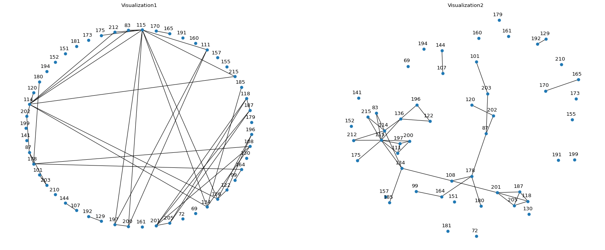
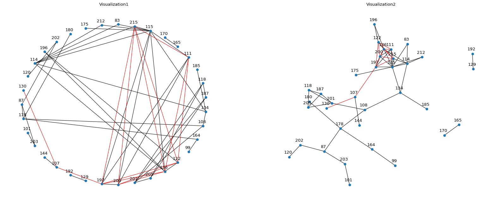

# **Complex Network Analysis** :crystal_ball:
## Analysis of a university social network of students :mag_right:
This project is based on a study about a social network of university students. In particular, the main objective is to use various link prediction techniques to find possible new friends and form new groups of friends.

### Introduction 
This type of analysis can be useful for predicting, for example, which student is more likely to become a leader or which pair of students are more likely to work together.

For the development of this project, data on friendships and acquaintances of students in the first year of a three-year computer course were collected using a form.
Various link prediction techniques will be used, applying a library implemented by ourselves, to analyze the social network and find new possible friendship links :telescope:.

The project consists of three main phases:

1. **Data collection**: the data used was extracted from a student social network and saved in a dataset in CSV format. 
2. **Data analysis**: using the Python programming language, the data was analyzed through data mining and network analysis techniques. In particular, several link prediction methods and algorithms are used to predict the likelihood of link creation.
3. **Analysis of results**

### Data :bar_chart:
In particular, various information was collected for each user using a form, such as:
- `age`
- `sex`
- `if a student is staying near the university or is a commuter`
- `main hobbies`
- `other students with whom you study together`
- `other students you date outside of university`
- `other students with whom you spend your lunch break`

For this type of analysis, we don't really need any other data than just the links and links already present in the students' social network.

### Library and methods used :green_book:
To analyze the social network we used a library implemented by us called `Complex-Network-Link-Prediction` which can be found [here](https://github.com/Typing-Monkeys/social-network-link-prediction).

This library allows you to use some of the main link prediction methods, starting from methods based on similarity, to probabilistic methods and so on.

Some of the methods used are listed below (the chosen methods are just some of the possible ones that can be used, consult the library and its documentation to see all the methods):
- **Similarity Approach**
    - ***Local Similarity***
        - common_neighbors
        - adamic_adar
        - jaccard
        - node_clustering
    - ***Gloabal Similarity***
        - katz_index
        - link_prediction_rwr
        - sim_rank
    - ***Quasi Local Similarity***
        - local_path_index
        - path_of_length_three
- **Probabilistic Method**
    - stochastic_block_model
- **Information Theory Approach**
    - path_entropy

(For more information about each method implementation see the [library documentation](https://typing-monkeys.github.io/social-network-link-prediction/))

For a more in-depth explanation of each method, we refer to the `LinkPrediction.md` file  :open_file_folder: present in this repository, which is based on a survey of methods for link prediction in which it describes the main methods we have implemented: [Link prediction techniques, applications, and performance: A survey](https://www.sciencedirect.com/science/article/abs/pii/S0378437120300856).

<hr>

### Project results :books:
The following are some example results obtainad by applyng some link prediction methods.

These are the original social network plot:


And here you can see the results after appliyng the `sthocastick_block_model` as link prediction method



<hr>

### How to use the project :pill:
To use the project, you need to perform the following steps:
1. **Download data:** The data used for the project is available in CSV format im `data/` folder :open_file_folder:. Obviously the data is anonymous and it is not possible to trace the original students.
2. **Install dependencies**: The project uses several Python libraries, such as pandas, networkx and social-network-link-prediction. Make sure you have them installed before proceeding. To install this we suggest to create a virtual environments and install the requirements presente in `requirements.txt` file :open_file_folder: using the following command steps:
- Create a virtual environment:
    ```bash
    virtualenv venv_snlp
    ```
- Activate venv to install project requirements
    ```bash
    source venv_snlp/bin/activate
    ```
- Move to project dir and Install requiremenst 
    ```bash
    pip install -r requirements.txt
    ```

3. **Run the code**: The code comes in a Python Jupyter Notebook (so in order to exevute it, use the virtual environment as kernel for the Notebook), which can be run using Jupyter. The code imports the dataset, performs data analysis and returns the results.

<hr>

### Conclusions :end:
Link Prediction for a student social network is an innovative project that uses data mining and network analysis techniques to predict the likelihood of link creation among students. The project can be used in different contexts, such as schools or universities, to predict social dynamics and improve teamwork.